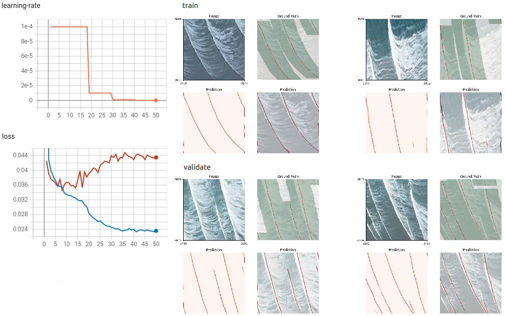
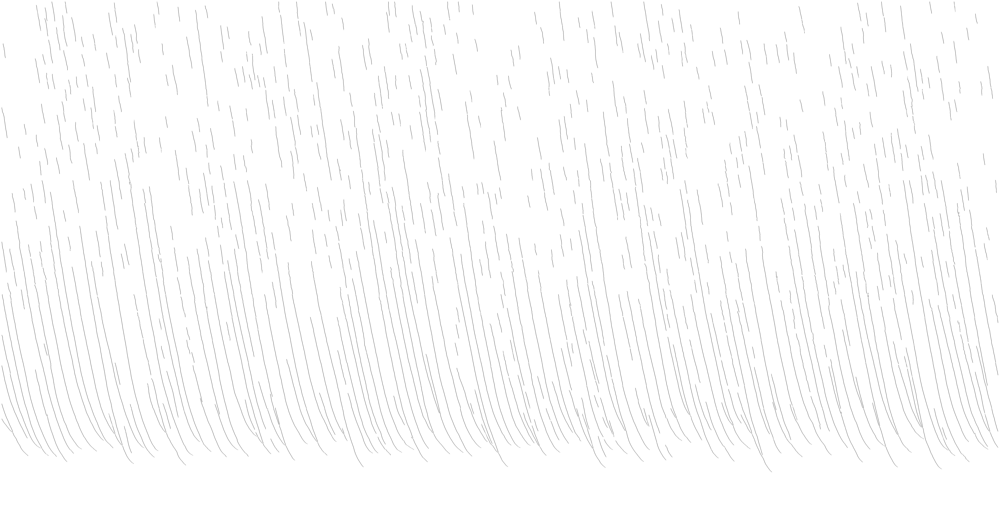

# Wave Crest Detection

We use a deep learning approach, implemented with PyTorch, to detect wave crests in time stack images.

Lange, Athina M.Z., Fiedler, Julia W., Merrifield, Mark A., Guza, R.T.
UAV video-based estimates of nearshore bathymetry (2023) Coastal Engineering

Nearshore bathymetry estimated from video acquired by a hovering UAV is compared with ground truth. Bathymetry estimates from the widely used cBathy algorithm are improved by crest tracking (with machine learning-aided annotations) from near breaking through the surf zone. Individual wave crests (distinguished from the breaking wave toe that can move down the wave front face) in video timestacks are determined with a deep-learning neural network and surfzone depth estimates are computed from the wave celerity. Time-2D spatial transforms (cBathy) are used to estimate wave celerity and depth between the surfzone and 10m depth. Composite profiles (cBathyCT), formed by joining cBathy and crest-tracking solutions near the surfzone seaward edge, based on a newly determined gamma(x) parameter, avoid the large cBathy errors associated with the onset of breaking. Including an additional topography survey for the foreshore region, provides full nearshore bathymetry profiles. Incident wave heights were relatively constant on each day, but varied over days between 0.55-2.15m. Averaged over all 17-minute hovers and cross-shore transects (112 total), surfzone depths errors were relatively small (average root-mean-square error < RMSE > = 0.17m, < Bias > = 0.06m) after including a heuristic nonlinear correction to the linear phase speed. Between the seaward surfzone edge and 10-m depth, errors are similar to previous cBathy studies: < RMSE > = 0.87m, < Bias > = 0.58m with the largest errors in deepest water. Beach profiles were generally similar for all 8 test days, concave up with a slight terrace (no sandbar) and small alongshore depth variations. Accuracy was lower on one transect with a shallow reef.


## Installation

### Ubuntu 18.04

#### Anaconda + pip3
[Anaconda](https://www.anaconda.com/) provides a convenient way to set up a python development environment.

```
Firefox: https://www.anaconda.com/products/individual
Firefox: Click on Linux Python 3.8 64-Bit (x86) Installer
$: bash ~/Downloads/Anaconda3-2021.05-Linux-x86_64.sh
```

Create a new python environment.

```
Ubuntu: Open a new terminal
$: conda create --name pytorch python=3.7
$: conda activate pytorch
```

Install libraries with pip3.

```
(pytorch)$: pip3 install torch torchvision torchaudio
numpy-1.21.1 pillow-8.3.1 torch-1.9.0 torchaudio-0.9.0 torchvision-0.10.0
(pytorch)$: pip3 install tensorboard pytorch-model-summary kornia opencv-python==4.4.0.46
tensorboard-2.6 pytorch-model-summary-0.1.2 kornia-0.5.8 opencv-python-4.4.0.46 tqdm-4.62.0
(pytorch)$: pip3 install ipython jupyter matplotlib pandas scipy
ipython-7.26.0 jupyter-1.0.0 matplotlib-3.4.3 pandas-1.3.1 scipy-1.7.1
```

To automatically activate pytorch, add “conda activate pytorch” to the ~/.bashrc file.

```
$: echo “conda activate pytorch” >> ~/.bashrc
```

#### PyCharm IDE

[PyCharm](https://www.jetbrains.com/pycharm/) is an Integrated Development Environment (IDE) for python. 
The community edition is free and can be installed on Ubuntu using the Ubuntu Software application.

## Dataset

### Training dataset
Full training dataset and resulting model can be found in GoogleDrive: training_data
https://tinyurl.com/timestack

RGB Image
```
./data/train/images	        20200707_Torrey_02C_timestack.png
			        20200707_Torrey_10C_11_timestack.png
```


Ground-Truth hand annotations of Wave Crests

```
./data/train/ground_truth	20200707_Torrey_02C_timestack_groundtruth.png
				20200707_Torrey_10C_11_timestack_groundtruth.png
```


### Validation dataset

```
./data/validate/images	        20200707_Torrey_10C_1_timestack.png
./data/validate/groundtruth	20200707_Torrey_10C_1_timestack_groundtruth.png
```

## Models

### U-Net with a ResNet18 encoder

We use a modified version of the U-Net with a ResNet18 encoder 
pre-trained on the ImageNet dataset from [UNet/FCN PyTorch](https://github.com/usuyama/pytorch-unet) .

The detection of wave crests in time stack images only depends on a limited neighborhood area in the image. 
The training and prediction does not need to be done on the entire image, 
but can be performed on small high-resolution image tiles. 
This increases the training dataset size and can reduce the complexity of the deep learning network. 
To augment the training dataset, image tiles are sampled at arbitrary locations in the image.

## Jupyter Notebook

We use a jupyter notebook for interactive development, testing and documentation.

```
(pytorch)$: jupyter notebook
Web page: Select WCD Notebook.ipynb
```

## Train
```
(pytorch)$: python train.py --help
usage: train.py [-h] [--model {unet-resnet18}] [--loss {BCE}]
                [--optimizer {RMS,Adam}]
                [--scheduler {ReduceLROnPlateau,StepLR}]
                [--samples-per-image N] [--sample-width N] [--sample-height N]
                [--mask-width N] [--epochs N] [--batch-size BS]
                [--learning-rate LR] [--load MODEL]

Train Wave Crests Detection model.
optional arguments:
  -h, --help                              show this help message and exit
  --model {unet-resnet18}                 model
  --loss {BCE}                            loss function
  --optimizer {RMS,Adam}                  optimizer
  --scheduler {ReduceLROnPlateau,StepLR}  scheduler
  --samples-per-image N                   number of samples per image
  --sample-width N                        sample width
  --sample-height N                       sample height
  --mask-width N                          ground-truth mask width (0 for no mask), dilation in x
  --epochs N                              number of epochs
  --batch-size N                          batch size
  --learning-rate N                       learning rate
  --load MODEL                            load model from a .pth file
```

```buildoutcfg
(pytorch)$: python train.py
INFO: Program arguments:
      Model:             unet-resnet18
      Loss:              BCE
      Optimizer:         RMS
      Scheduler:         ReduceLROnPlateau
      Samples per image: 1000
      Sample width:      256
      Sample width:      256
      Mask width:        100
      Epochs:            50
      Batch size:        8
      Learning rate:     0.0001
      Load:              None
INFO: Device: cuda
INFO: Model: unet-resnet18
--------------------------------------------------------------------------
      Layer (type)           Output Shape         Param #     Tr. Param #
==========================================================================
          Conv2d-1      [8, 64, 256, 256]           1,792           1,792
            ReLU-2      [8, 64, 256, 256]               0               0
          Conv2d-3      [8, 64, 256, 256]          36,928          36,928
            ReLU-4      [8, 64, 256, 256]               0               0
          Conv2d-5      [8, 64, 128, 128]           9,408           9,408
     BatchNorm2d-6      [8, 64, 128, 128]             128             128
            ReLU-7      [8, 64, 128, 128]               0               0
       MaxPool2d-8        [8, 64, 64, 64]               0               0
      BasicBlock-9        [8, 64, 64, 64]          73,984          73,984
     BasicBlock-10        [8, 64, 64, 64]          73,984          73,984
     BasicBlock-11       [8, 128, 32, 32]         230,144         230,144
     BasicBlock-12       [8, 128, 32, 32]         295,424         295,424
     BasicBlock-13       [8, 256, 16, 16]         919,040         919,040
     BasicBlock-14       [8, 256, 16, 16]       1,180,672       1,180,672
     BasicBlock-15         [8, 512, 8, 8]       3,673,088       3,673,088
     BasicBlock-16         [8, 512, 8, 8]       4,720,640       4,720,640
         Conv2d-17         [8, 512, 8, 8]         262,656         262,656
           ReLU-18         [8, 512, 8, 8]               0               0
       Upsample-19       [8, 512, 16, 16]               0               0
         Conv2d-20       [8, 256, 16, 16]          65,792          65,792
           ReLU-21       [8, 256, 16, 16]               0               0
         Conv2d-22       [8, 512, 16, 16]       3,539,456       3,539,456
           ReLU-23       [8, 512, 16, 16]               0               0
         Conv2d-24       [8, 128, 32, 32]          16,512          16,512
           ReLU-25       [8, 128, 32, 32]               0               0
         Conv2d-26       [8, 256, 32, 32]       1,474,816       1,474,816
           ReLU-27       [8, 256, 32, 32]               0               0
         Conv2d-28        [8, 64, 64, 64]           4,160           4,160
           ReLU-29        [8, 64, 64, 64]               0               0
         Conv2d-30       [8, 256, 64, 64]         737,536         737,536
           ReLU-31       [8, 256, 64, 64]               0               0
         Conv2d-32      [8, 64, 128, 128]           4,160           4,160
           ReLU-33      [8, 64, 128, 128]               0               0
         Conv2d-34     [8, 128, 128, 128]         368,768         368,768
           ReLU-35     [8, 128, 128, 128]               0               0
         Conv2d-36      [8, 64, 256, 256]         110,656         110,656
           ReLU-37      [8, 64, 256, 256]               0               0
         Conv2d-38       [8, 1, 256, 256]              65              65
==========================================================================
Total params: 17,799,809
Trainable params: 17,799,809
Non-trainable params: 0
--------------------------------------------------------------------------
INFO: Created dataset with 2 wave time stack images and corresponding crest ground-truth annotation images with the following ids: 
['20200707_Torrey_10C_11_timestack', '20200707_Torrey_02C_timestack']
INFO: Created dataset with 1 wave time stack images and corresponding crest ground-truth annotation images with the following ids: 
['20200707_Torrey_10C_1_timestack']
Epoch 1/50: 100%|█████████████████████████████████████████████████████████████| 250/250 [06:12<00:00,  1.49s/batch, loss-train=0.295]
Validate :  85%|███████████████████████████████████████████████████▏        | 853/1000 [02:50<00:29,  5.00batch/s, loss-validate=0.0426]
INFO: Created checkpoint directory
INFO: Saved model at checkpoint epoch 1.
Epoch 2/50: 100%|███████████████████████████████████████████████████████████████| 250/250 [06:08<00:00,  1.48s/batch, loss-train=0.0429]
Validate :  86%|███████████████████████████████████████████████████▋        | 861/1000 [02:51<00:27,  5.03batch/s, loss-validate=0.0391]
INFO: Saved model at checkpoint epoch 2.
...
Epoch 50/50: 100%|██████████████████████████████████████████████████████████████| 250/250 [06:16<00:00,  1.51s/batch, loss-train=0.0236]
Validate :  85%|██████████████████████████████████████████████████▊         | 847/1000 [02:52<00:31,  4.90batch/s, loss-validate=0.0435]
INFO: Saved model at checkpoint epoch 50.
```
On a desktop computer with a GeForce GTX 1660 GPU, it took 7.5 hours to train the model for 50 epochs.

### Tensorboard

```
(pytorch)$: tensorboard --logdir=runs
TensorBoard 2.6.0 at http://localhost:6006/ (Press CTRL+C to quit)
```


When the ground-truth is not provided for all waves in the image,
the loss function is limited to regions around the provided ground-truth.

The model overfits after 17 epochs.

## Predict

```
(pytorch)$: python predict.py --help
usage: predict.py [-h] [--model {unet-resnet18}] --load MODEL
                  [--sample-width N] [--sample-height N] --image IMAGE
                  [--processing-window-top N] [--processing-window-bottom N]
                  [--processing-window-left N] [--processing-window-right N]
                  [--processing-crop-margin N] [--filter-interactive 0/1]
                  [--filter-threshold N] [--filter-line-width N]
                  [--filter-gap-close N] [--filter-length-min N]
                  [--filter-skeleton 0/1] [--filter-surf-zone 0/1]
                  [--filter-overlay-flag 0/1] [--prediction-suffix SUFFIX]
                  [--prediction-overlay-suffix SUFFIX]

Wave Crests Detection.

optional arguments:
  -h, --help                          show this help message and exit
  --model {unet-resnet18}             model
  --load MODEL                        load model from a .pth file
  --sample-width N                    sample width
  --sample-height N                   sample height
  --image IMAGE                       load RGB image from a .png file
  --processing-window-top N           processing window top
  --processing-window-bottom N        processing window bottom (-1 bottom of image)
  --processing-window-left N          processing window left
  --processing-window-right N         processing window right (-1 right of image)
  --processing-crop-margin N          processing crop margin
  --filter-interactive 0/1            use filter interactively (or in batch mode)
  --filter-threshold N                filter threshold
  --filter-line-width N               filter line width
  --filter-gap-close N                filter gap close
  --filter-length-min N               filter length min
  --filter-skeleton 0/1               filter thin lines to skeleton
  --filter-surf-zone 0/1              filter restrict to surf zone
  --filter-overlay-flag 0/1           filter overlay (on image + surf zone)
  --prediction-suffix SUFFIX          prediction file suffix including file extension
  --prediction-overlay-suffix SUFFIX  prediction overlay file suffix including file extension
```

The detected wave crests can be post-processed interactively, or in batch mode, with a suite of image analysis filters.

```buildoutcfg
(pytorch)$: python predict.py  --load checkpoints/model_epoch50.pth \
                               --processing-window-bottom 4700 \
                               --image data/validate/images/20200707_Torrey_10C_1_timestack.png
INFO: Program arguments:
      Model:                                         unet-resnet18
      Load:                                          checkpoints/model_epoch17.pth
      Sample width:                                  256
      Sample height:                                 256
      Image:                                         data/validate/images/20200707_Torrey_10C_1_timestack.png
      Processing window top:                         0
      Processing window bottom (-1 bottom of image): 4700
      Processing window left:                        0
      Processing window right (-1 right of image):   -1
      Processing crop margin:                        16
      Filter interactive use (vs in batch mode)      True 
      Filter threshold:                              0.05
      Filter line width:                             3
      Filter gap close:                              5
      Filter length min:                             100
      Filter skeleton:                               True
      Filter surf zone:                              False
      Filter overlay:                                False
      Prediction file suffix:                        _prediction.jpg
      Prediction overlay file suffix:                _prediction_overlay.png
INFO: Device: cpu
INFO: Model loaded from checkpoints/model_epoch17.pth
Tile-based Prediction: 100%|████████████████████████████████████████████████████████████████████████| 924/924 [02:29<00:00,  6.18tile/s]
INFO: Adjust parameters interactively and hit ENTER to exit
INFO: Threshold 0.05
INFO: Detect peaks in lines 3
INFO: Close small gaps in line 5
INFO: Min length 100
INFO: Skeleton True
INFO: Surf Zone False
INFO: Overlay False
INFO: ---
INFO: Saved prediction image as 20200707_Torrey_10C_1_timestack_prediction.jpg
INFO: Saved prediction overlay image as 20200707_Torrey_10C_1_timestack_prediction_overlay.png
INFO: Close Figure to end program
```
On a desktop computer, not using a GPU, it took under 10 min to do the prediction for an entire image 
using tile-based processing.

RGB Image


Prediction


